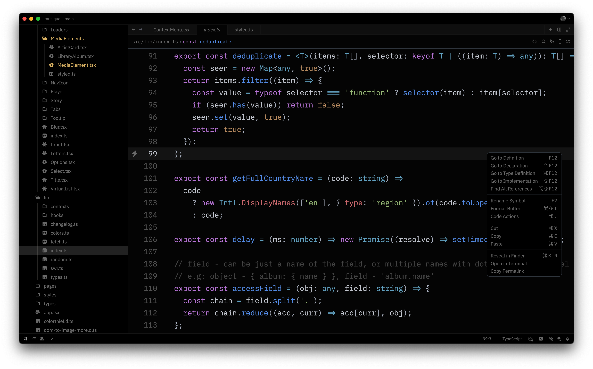

# one-black-theme-zed
> One Dark got even dar..kier

## This is how awesome it is:

## How to use?
1. Open Zed.
2. `cmd+shift+p` and look for `zed: extensions` or just `cmd+shift+x`
3. Search for "One Black Theme" and Install
4. Select "One Black Theme" in the theme dropdown (`cmd+k+t`, or `cmd+shift+p` -> `theme selector: toggle`).

> If you notice anything weird or not working/displayed properly lmk ty glhf

## License

MIT
